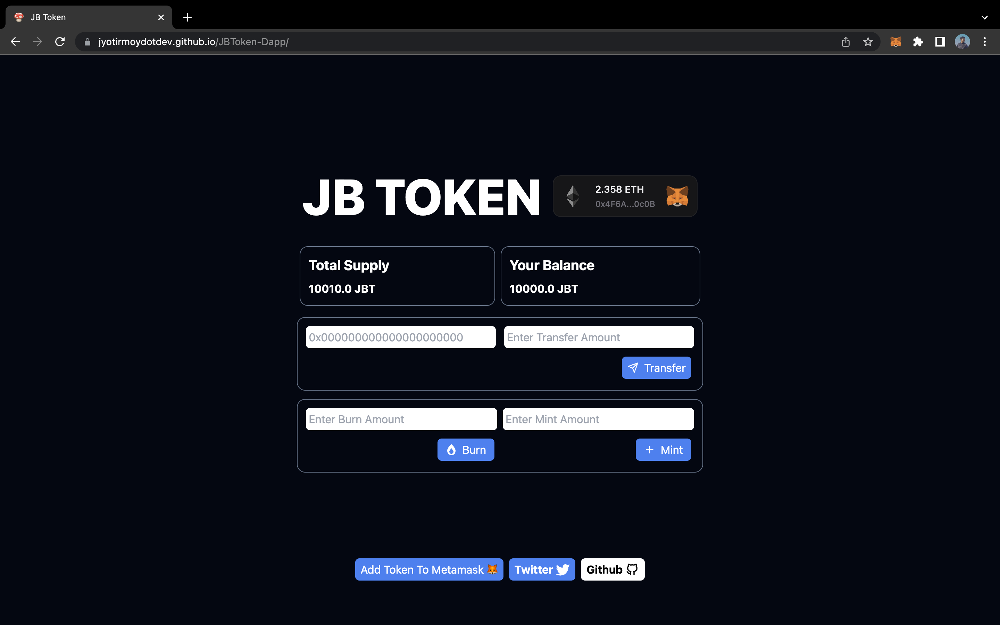

# JB Token Dapp



<p align="center">
    <a href="https://jyotirmoydotdev.github.io/JBToken-Dapp/">View Demo</a>
    .
    <a href="https://sepolia.etherscan.io/address/0xFe1Bbf2d1467043b26CFD2BecA04b3A5A00fFff1">Contract Address</a>
</p>

## Project Description
JBToken-Dapp is a decentralized application (Dapp) project that focuses on generating tokens using blockchain technology. The application uses Ethereum blockchain and is developed with Solidity language, Foundry Framework, and React.js. The application allows users to generate, distribute and transfer tokens in a decentralized manner, ensuring secure and transparent transactions.

### Contract Address on [Sepolia Testnet](https://sepolia.etherscan.io/address/0xFe1Bbf2d1467043b26CFD2BecA04b3A5A00fFff1)
``` solidity
0xFe1Bbf2d1467043b26CFD2BecA04b3A5A00fFff1
```

## Built With

This section has the list of frameworks/libraries used to bootstrap my project.
<div align="center">

 
 
 
 
 
 
 

</div>

## Installation

To install the project, clone the repository to your local machine.
```
git clone https://github.com/jyotirmoydotdev/JBToken-Dapp.git
```
Navigate to the project directory.
```
cd JBToken-Dapp
```
Install the dependencies.
```
npm install
```
Start the local development server.
```
npm run start
```
The application will be running at `http://localhost:3000`.

## Usage

Once the application is running, you can interact with it through the browser. Here, you can generate tokens by specifying the total supply and the name of the token. You can also distribute and transfer tokens to different Ethereum addresses.

## Contributing

Contributions are welcome. If you find any bugs or have suggestions for improvements, please open an issue. If you'd like to contribute code, please fork the repository and use a feature branch. Pull requests are warmly welcome.

## License

This project is licensed under the MIT License.

## Contact
- Twitter - [@jyotirmoydotdev](httsp://twitter.com/jyotirmoydotdev)
- Email - [jyotirmoydotdev@gmail.com](mailto:jyotirmoydotdev@gmail.com)